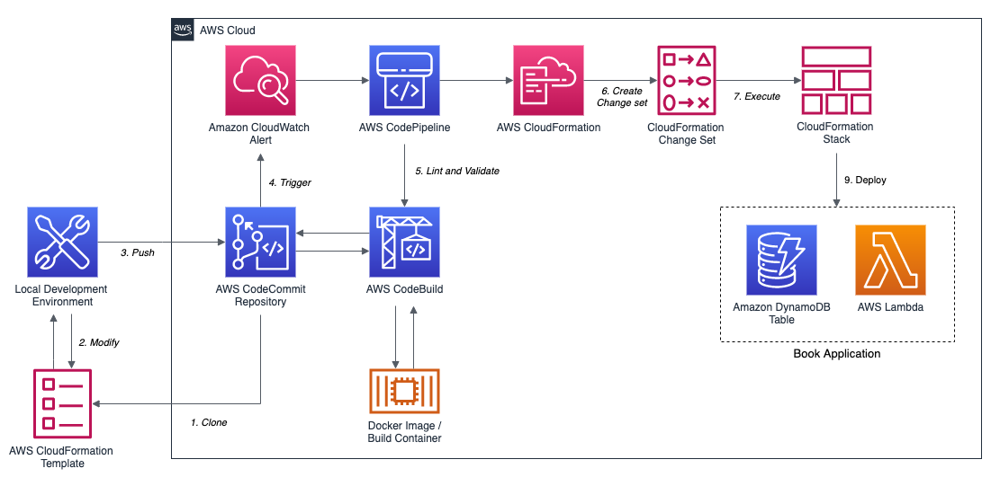
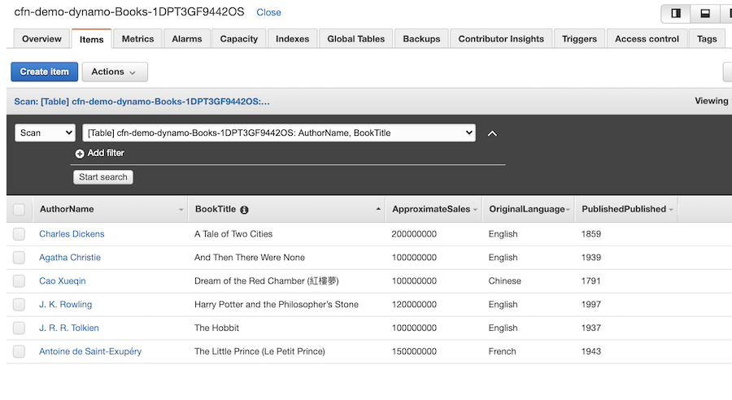

# AWS CloudFormation CI/CD Demonstration

_Work in progress..._

## Overview

Demonstration of an Infrastructure as Code (IaC) Continuous Integration and Continuous Delivery (CI/CD) pipeline. Use [AWS CloudFormation](https://docs.aws.amazon.com/cloudformation/index.html) to create an [AWS CodePipeline](https://aws.amazon.com/codepipeline/) pipeline and associated AWS resources. Then, use the pipeline to test and deploy AWS resources, including [Amazon DynamoDB](https://aws.amazon.com/dynamodb/) and [AWS Lambda](https://aws.amazon.com/lambda/), using a CloudFormation template, CloudFormation configuration file, and CloudFormation stack change set.

The demonstration is useful for comparing the advantages of CI/CD, IaC, and pipeline automation, to using the [AWS Command Line Interface](https://aws.amazon.com/cli/) (AWS CLI) in an ad hoc fashion to execute similar CloudFormation functionality.



<small>_\*CloudWatch not yet implemented_</small>

### IaC Testing

Current linting and validation testing tools demonstrated herein, include the following:

1. [`yamllint`](https://yamllint.readthedocs.io/en/stable/#) - CloudFormation template
2. [`cfn-lint`](https://github.com/aws-cloudformation/cfn-python-lint) - CloudFormation template
3. [`jsonlint`](http://manpages.ubuntu.com/manpages/cosmic/man1/jsonlint-php.1.html) (`php-jsonlint`) - CloudFormation template config (JSON)
4. [`cloudformation validate-template`](https://docs.aws.amazon.com/cli/latest/reference/cloudformation/validate-template.html) - CloudFormation template

Future testing tools to include AWS [`taskcat`](https://github.com/aws-quickstart/taskcat).

Configuration of the tools can be found in the [`buildspec_test.yml`](code-commit-source-code/buildspec_test.yml) file.

A sample of `yamllint` errors can be found in the [`yamllint_example.txt`](yamllint_example.txt) file.

## Helpful AWS CLI Commands

```bash
aws cloudformation help
aws cloudformation <command> help
```

## Prerequisites

The demonstration requires you have an AWS account with the proper level of access to create the required resources, and the following tools installed locally:

1. [git](https://git-scm.com/)
2. [AWS CLI](https://aws.amazon.com/cli/)
3. [jq](https://stedolan.github.io/jq/)
4. [Python](https://www.python.org/)

Note, the demo was built on a Mac. It should also work with Linux. Some commands may need to be modified for Windows, including the use of the data creation Shell script.

## Basic CloudFormation Functions using the AWS CLI

Manually perform CloudFormation functions, without the use of a proper CI/CD pipeline.

### Step 1

Create the CloudFormation stack from the template.

```bash
aws cloudformation create-stack \
  --stack-name cfn-demo-dynamo \
  --template-body file://dynamo.yaml \
  --parameters ParameterKey=ReadCapacityUnits,ParameterValue=10 \
               ParameterKey=WriteCapacityUnits,ParameterValue=25

aws cloudformation describe-stack-events \
    --stack-name cfn-demo-dynamo | jq .
```

### Step  2

Make arbitrary changes to the template and update stack.

```bash
aws cloudformation update-stack \
  --stack-name cfn-demo-dynamo \
  --template-body file://dynamo.yaml \
  --parameters ParameterKey=ReadCapacityUnits,ParameterValue=5 \
               ParameterKey=WriteCapacityUnits,ParameterValue=15
```

### Step  3

Create and execute a stack change set using AWS CLI.

```bash
aws cloudformation create-change-set \
    --stack-name cfn-demo-dynamo \
    --change-set-name demo-change-set \
    --template-body file://dynamo_revisions.yaml \
    --parameters ParameterKey=ReadCapacityUnits,ParameterValue=5 \
                 ParameterKey=WriteCapacityUnits,ParameterValue=15
```

```bash
aws cloudformation execute-change-set \
    --stack-name cfn-demo-dynamo \
    --change-set-name demo-change-set
```

### Step  4

Detect stack drift using AWS CLI. First, make an arbitrary change to the stack's resources, using the AWS Management Console.

```bash
aws cloudformation detect-stack-drift \
    --stack-name cfn-demo-dynamo
```

May take a minute to complete.

```bash
aws cloudformation describe-stack-resource-drifts \
    --stack-name cfn-demo-dynamo
```

Look for a line in the output similar to `"StackResourceDriftStatus": "IN_SYNC",`.

### Step  5

Delete the stack before continuing.

```bash
aws cloudformation delete-stack \
    --stack-name cfn-demo-dynamo
```

## Getting Started with AWS CodePipeline Demo

### Step  1

Provision the [AWS CodeCommit](https://aws.amazon.com/codecommit/) IAM User and Group.

```bash
aws cloudformation create-stack \
  --stack-name cfn-demo-iam \
  --template-body file://cfn-templates/code_commit_iam.yaml \
  --capabilities CAPABILITY_IAM
```

### Step  2

Provision the AWS CodeCommit project and associated AWS resources. Amazon SNS Topic, created by template, is not used in this demo.

```bash
aws cloudformation create-stack \
  --stack-name cfn-demo-code-commit \
  --template-body file://cfn-templates/code_commit.yaml \
  --capabilities CAPABILITY_IAM
```

### Step  3a

For HTTPS connection to CodeCommit:

Manually configure the 'HTTPS Git credentials for AWS CodeCommit' feature for IAM User using the AWS Management Console. Can't do with CFN?

### Step  3b (_optional_)

For SSH connection to CodeCommit:

Manually configure the 'SSH keys for AWS CodeCommit' public key feature for IAM User using the AWS Management Console. Can't do with CFN?

```bash
cat ~/.ssh/id_rsa.pub | pbcopy
```

---

Optional, remove older CodeCommit credentials and ssh entries, if you are getting log in issues with AWS CodeCommit.

- <https://docs.aws.amazon.com/codecommit/latest/userguide/troubleshooting-ch.html#troubleshooting-macoshttps>
- <https://stackoverflow.com/a/20195558/580268>

```bash
git config --global credential.helper osxkeychain
```

For ssh issues, try deleting entry starting with `git-codecommit.us-east-1.amazonaws.com`.

```bash
vim ~/.ssh/known_hosts
```

---

### Step  4

Configure [Git CodeCommit credentials helper](https://docs.aws.amazon.com/codecommit/latest/userguide/setting-up-https-unixes.html).

```bash
git config --global credential.helper '!aws codecommit credential-helper $@'
git config --global credential.UseHttpPath true
```

### Step  5

Clone the CodeCommit repository, `cfn-demo-repo`. I have used `us-east-1`. Please confirm your exact URL for HTTPS or SSH, using the AWS CodeCommit Console.

```bash
# for https:
git clone https://git-codecommit.us-east-1.amazonaws.com/v1/repos/cfn-demo-repo
```

```bash
# or optional, for ssh:
git clone ssh://git-codecommit.us-east-1.amazonaws.com/v1/repos/cfn-demo-repo
```

You will be asked for the username and password you manually created for the AWS IAM User in Step 3a, above. Ignore empty repo message when cloning the project.

### Step  6

Copy source code files into new CodeCommit repository, `cfn-demo-repo`, from this project. Make sure you are starting from the CodeCommit repository directory, locally.

```bash
cd ../cfn-demo-repo

cp ../aws-cfn-demo/code-commit-source-code/*.* .
cp ../aws-cfn-demo/code-commit-source-code/.gitignore .
cp -R ../aws-cfn-demo/code-commit-source-code/data/ ./data
```

Commit and push the source code files to the new AWS CodeCommit repository.

```bash
git add -A
git commit -m "Initial commit"
git push
```


### Step  7

Provision the Amazon CodePipeline pipeline, `cfn-infra-pipeline`, and associated AWS resources. Amazon SNS Topic, created by template, is not used in this demo.

```bash
aws cloudformation create-stack \
  --stack-name cfn-demo-code-pipeline \
  --template-body file://cfn-templates/code_pipeline.yaml \
  --capabilities CAPABILITY_IAM
```

Pipeline should automatically start. If not use the following command.

```bash
aws codepipeline start-pipeline-execution \
    --name CloudFormationDemo
```

Manually approve the CloudFormation Change set in the new Amazon CodePipeline Deploy stage, using the Amazon Management Console. Once the pipelines completes, the stack is deployed.

### Step  8 (_optional_)

To test the newly deployed resources, put test data into the newly created Amazon DynamoDB `Books` table, using the newly created AWS Lambda function. From your local command line, execute the following commands.

```bash
cd data
sh ./put_book.sh
```

```text
{"AuthorName":"Charles Dickens","BookTitle":"A Tale of Two Cities","PublishedPublished":1859,"OriginalLanguage":"English","ApproximateSales":200000000}
{"AuthorName":"Antoine de Saint-Exupéry","BookTitle":"The Little Prince (Le Petit Prince)","PublishedPublished":1943,"OriginalLanguage":"French","ApproximateSales":150000000}
{"AuthorName":"J. K. Rowling","BookTitle":"Harry Potter and the Philosopher’s Stone","PublishedPublished":1997,"OriginalLanguage":"English","ApproximateSales":120000000}
{"AuthorName":"J. R. R. Tolkien","BookTitle":"The Hobbit","PublishedPublished":1937,"OriginalLanguage":"English","ApproximateSales":100000000}
{"AuthorName":"Agatha Christie","BookTitle":"And Then There Were None","PublishedPublished":1939,"OriginalLanguage":"English","ApproximateSales":100000000}
{"AuthorName":"Cao Xueqin","BookTitle":"Dream of the Red Chamber (紅樓夢)","PublishedPublished":1791,"OriginalLanguage":"Chinese","ApproximateSales":100000000}
```

Check the Amazon DynamoDB `Books` table. It should now have (6) items.



### Step  9

Create a change. Copy revised contents file to current template.

```bash
cat dynamo_revisions.yaml > dynamo.yaml

git add -A
git commit -m "Enable TTL and add Tags to DynamoDB table"
git push
```

Pipeline should automatically start. If not use the following command.

```bash
aws codepipeline start-pipeline-execution \
    --name CloudFormationDemo
```


## Delete CloudFormation Stacks using AWS CLI

Delete one stack at a time, letting each one finish completely, before proceeding to the next stack.

```bash
aws cloudformation delete-stack \
    --stack-name cfn-demo-dynamo
```

```bash
aws cloudformation delete-stack \
    --stack-name cfn-demo-code-pipeline
```

```bash
aws cloudformation delete-stack \
    --stack-name cfn-demo-code-commit
```

Manually delete 'HTTPS Git credentials for AWS CodeCommit' entry from AWS IAM User, `CodeCommitUser`, using the AWS Management Console, or next step will fail.

```bash
aws cloudformation delete-stack \
    --stack-name cfn-demo-iam
```

## References

- <https://docs.aws.amazon.com/codebuild/latest/userguide/jenkins-plugin.html>
- <https://github.com/stelligent/cloudformation_templates/blob/master/labs/codebuild/codebuild.yml>
- <https://kb.novaordis.com/index.php/AWS_CodeBuild_Buildspec>
- <https://github.com/adrienverge/yamllint>
- <https://docs.aws.amazon.com/codepipeline/latest/userguide/tutorials-cloudformation-codecommit.html>
- <https://aws.amazon.com/blogs/devops/custom-lookup-using-aws-lambda-and-amazon-dynamodb/>
- <https://docs.aws.amazon.com/codebuild/latest/userguide/jenkins-plugin.html>
- <https://docs.aws.amazon.com/AWSCloudFormation/latest/UserGuide/deploying.applications.html>
